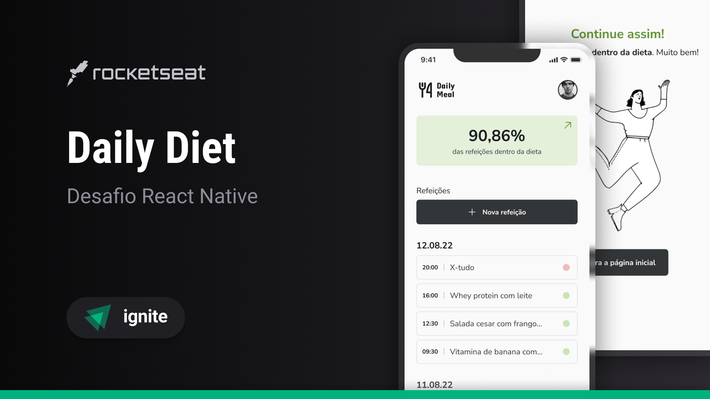

<p align='center'>
  
</p>




Daily Diet é uma aplicação mobile para controle da sua dieta. Nele você pode registrar suas refeições, acompanhar como está seu progresso e garantir que  esteja no caminho certo para alcançar seus objetivos de uma alimentação saudável.

## 🎨 Layout da aplicação
Você pode visualizar o layout do projeto no Figma [aqui](https://www.figma.com/file/laFn3FnTINQXltdskpJx50/Daily-Diet-%E2%80%A2-Desafio-React-Native-(Community)?type=design&mode=design&t=TIGriwPC506fucwk-0).

## ⚙️ Funcionalidades
- Adicionar uma nova refeição
- Editar uma refeição
- Remover uma refeição da listagem
- Mostrar as estatísticas do progresso da dieta
- Navegação entre telas em pilha
- Armazenamento local das refeições

## 🛠️ Tecnologias e ferrementas utilizadas

- [TypeScript](https://www.typescriptlang.org/)
- [React Native](https://reactnative.dev/)
- [Expo](https://expo.dev/)
- [Styled components](https://styled-components.com/)
- [React Native SVG](https://github.com/software-mansion/react-native-svg)
- [phosphor-react-native](https://github.com/duongdev/phosphor-react-native)
- [date-fns](https://date-fns.org/)
- [React Navigation](https://reactnavigation.org/)
- [react-native-safe-area-context](https://github.com/th3rdwave/react-native-safe-area-context)
- [React Native Screens](https://github.com/software-mansion/react-native-screens)
- [React Native Async Storage](https://docs.expo.dev/versions/latest/sdk/async-storage/)

## 💻 Instalando e rodando o projeto localmente
#### Requisitos
- Node.js
- Gerenciador de pacotes
- Um dispositivo móvel ou simulador para rodar o aplicativo

```bash
# Passo 1: Clone este repositório
$ git clone https://github.com/welisonw/ignite-rn-desafio02-daily-diet.git


# Passo 2: Acessa a pasta do projeto
$ cd ignite-rn-desafio02-daily-diet


# Passo 3: Instale as dependências
## npm
$ npm install

## yarn
$ yarn install


# Passo 4: Inicie o projeto
## npm
$ npx expo start

## yarn
$ yarn expo start

# Escaneie o QR Code gerado com seu dispositivo móvel ou utilize um simulador para rodar o aplicativo.
```

## 📝 Licença
Esse projeto está sob a licença **MIT**. Veja o arquivo [LICENSE](LICENSE) para mais detalhes.
